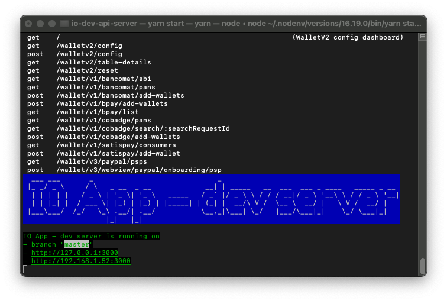
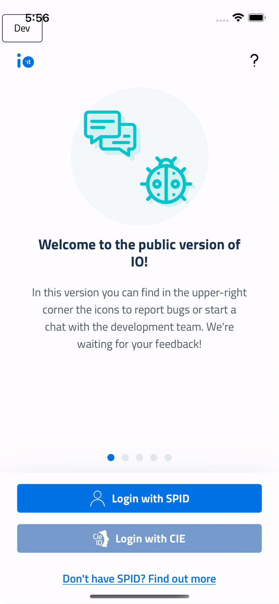

<h1 align="center">
  
  <br>
  IO dev API server
  <br>
</h1>

<h4 align="center">Mock server of <a href="https://github.com/pagopa/io-backend">io-backend</a> for <a href="https://github.com/pagopa/io-app">io-app</a> development.</h4>

<p align="center">
  <a href="https://app.codecov.io/gh/pagopa/io-dev-api-server">
    
  </a>
</p>

## Table of contents
* [Features](#features)
* [Local setup](#local-setup)
* [Docker setup](#docker-setup)
* [Usage with the app](#usage-with-the-app)

## Features
The test server has been created to make the app development process easier and more productive. Therefore you can:
- Run it on local machines without an internet connection;
- Change response payloads to test and stress the app;
- Add new paths and handlers to integrate and test features not yet released;
- Understand flows and data exchanged between app and backend.

<details>
   <summary>Login</summary>
   The current login implementation by-passes SPID authentication: when the user asks for a login with a certain SPID Identity Provider, the server responses with a redirect containing the session token. The user will be immediately logged in.
   <br><br>
   
</details>

<details>
   <summary>Session</summary>
   When the client asks for a session, a valid session is always returned. Of course the developer could implement a logic to return an expired session response to test different scenarios.
</details>


## Local setup
We recommend the use of a virtual environment, [nodenv](https://github.com/nodenv/nodenv) is the chosen virtual environment for this guide, along with [pnpm](https://pnpm.io/) for managing dependencies. From your command line, run:

```bash
# Clone io-app monorepo
$ git clone https://github.com/pagopa/io-app

# CD into the monorepo
$ cd io-app

# Install node with nodenv, the returned version should match the one in the .node-version file
$ nodenv install && nodenv version

# Install pnpm and rehash to install shims
$ npm install -g pnpm && nodenv rehash

# Install dependencies
# Run this only while setting up and when dependencies change
$ pnpm nx run @io-app/main-app:setup

# Generate API definitions
# Run this only while setting up and when io-backend specs change
$ pnpm nx run @io-app/api-types:generate

# Start the server
$ pnpm nx run @io-app/dev-api-server:start
```
***Note***: The default port (3000) can be changed in the [server.ts](src/utils/server.ts) file.
## Docker setup
A [Docker](https://www.docker.com/get-started) image is also available for local dev purposes. From your command line, run:
```bash
# Login into the GitHub container registry
# Reference: https://docs.github.com/en/packages/working-with-a-github-packages-registry/working-with-the-container-registry
$ echo <GITHUB_TOKEN> | docker login ghcr.io -u <YOUR_GITHUB_USERNAME> --password-stdin

# Pull the latest Docker image 
# Other versions can be found here: https://github.com/pagopa/io-dev-api-server/pkgs/container/io-dev-api-server%2Fio-dev-api-server
$ docker pull ghcr.io/pagopa/io-dev-api-server/io-dev-api-server:latest

# Run the Docker container at http://127.0.0.1:<YOUR_HOST_PORT>/
$ docker run -d -p <YOUR_HOST_PORT>:3000 ghcr.io/pagopa/io-dev-api-server/io-dev-api-server:latest
```

## Usage with the app
Run the server, either locally on via Docker. Then, from your command line:
```bash
# CD into the app folder
$ cd io-app

# Use the local env 
# You can edit the server endpoint on your needs
$ cp .env.local .env 

# Run the app on iOS or Android
$ pnpm nx run @io-app/main-app:run-ios (or pnpm nx run @io-app/main-app:dev-run-android)
```

## Lollipop
Server is able to verify lollipop header's signatures on incoming requests, provided a previously valid login that set both public key and public assertion (`GET /login` endpoint).

In order to enable lollipop on an endpoint, just wrap the middleware function that handles such endpoint with the `lollipopMiddleware` function (`src/middleware/lollipopMiddleware.ts`).
```
// Handler without lollipop
addHandler(
  messageRouter,
  "get",
  addApiV1Prefix("/third-party-messages/:id/precondition"),
  (req, res) => {...}
)

// Handler with lollipop
addHandler(
  messageRouter,
  "get",
  addApiV1Prefix("/third-party-messages/:id/precondition"),
  lollipopMiddleware((req, res) => {...})
)
```

The lollipop middleware runs before the wrapped function and automatically rejects-and-block any request that is not lollipop compliant (so the wrapped function is not executed in such case).
Public key and Assertion Ref can be retrieved using `getPublicKey` and `getAssertionRef` (`src/persistence/lollipop.ts` - provided a previously valid login on the GET /login endpoint).

Regardless of how many endpoints have been wrapped, the lollipop middleware can be globally disabled using the `config.feature.lollipop.enabled` flag (default true).

## FastLogin
Server is able to perform a FastLogin.
A FastLogin is a type of login that provides a very short session which is automatically renewed by calling the `fastlogin` endpoint. 

To enable this feature, you must set the FeatureFlag to a minimum version higher than `0.0.0` in `src/payloads/backend.ts`
```
fastLogin: {
      min_app_version: {
        ios: "1.0.0",
        android: "1.0.0"
      }
    }

```
If you want, you can specify a different minimum supported version for ios and android.

To enable Fast Login Opt-In screen, you must set its feature flag to a minimum version higher than `0.0.0` as shown below:

```
fastLogin: {
  min_app_version: {        
    ios: "1.0.0",
    android: "1.0.0"
  },
  opt_in: {
    min_app_version: {          
      ios: "1.0.0",
      android: "1.0.0"
    }
  }
```

It will be possible to renew the session via the `fastlogin` endpoint until the expiration date of the `assertionRef`.

You can configure the duration of the session by associating a value in MS to `sessionTTLinMS` in the `config.ts` file > `features/fastlogin`.

In the same file it is possible to configure the duration of the `assertionRef`, giving a value in MS to the key `lollipop/assertionRefValidityMS`. If no value is specified for this key, `assertionRef` gets infinite validity.

## Email Validation
Server is able to validate/invalidate an email address with the below endpoints:

```
POST /validate-profile-email with body { value: boolean }
```

## Email Already Taken
Server is able to set/reset if an email address is already taken with the below endpoints:

```
POST /set-email-already-taken with body { value: boolean }
```
## Uniqueness of email validation flow test
In order to test the uniqueness of email validation flow, the `config/config.json` file must use configurations (of course you can edit them as you need): 

```
{
  "profile": {
    "attrs": {
      "name": "Gian Maria",
      "is_email_validated": false,
      "is_email_already_taken": false, 
      "fiscal_code": "AAAAAA00A00A000M"
    }
  }
}

```
and to validate/invalidate the email or make the email already taken you have to navigate from the browser to `http://localhost:3000/`
