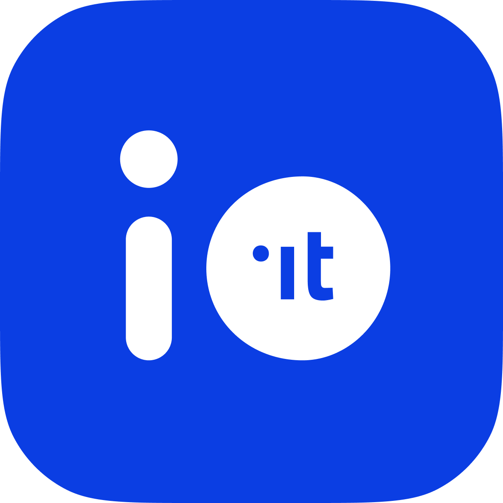

<p align="center">
  <br />
  <h3 align="center">IO — The Italian public services app</h3>
</p>

<p align="center">
  <a href="https://github.com/pagopa/io-app/actions/workflows/publish-app-build-nightly.yml">
    
  </a>
  <a href="https://codecov.io/gh/pagopa/io-app">
    
  </a>
  
</p>

<p align="center">
  <a href="https://apps.apple.com/it/app/io/id1501681835">
    
  </a>
  <a href="https://play.google.com/store/apps/details?id=it.pagopa.io.app">
    
  </a>
</p>

---

# IO — Main app

**IO** is the official Italian app for public services. It lets citizens access messages from public administrations, pay taxes and fines, manage their digital identity, and interact with dozens of government services from a single, accessible interface.

This directory is the **React Native application** at the core of the IO App ecosystem. It lives inside the [`pagopa/io-app`](https://github.com/pagopa/io-app) monorepo alongside the [design system library](../../libs/design-system/README.md).

---

## Table of contents

- [FAQ](#faq)
- [Getting started](#getting-started)
- [Environment variables](#environment-variables)
- [Run the app](#run-the-app)
- [Troubleshooting](#troubleshooting)
- [Architecture](#architecture)
- [Appendix](#appendix)

---

## FAQ

### What is the IO project?

IO aims at bringing citizens to the centre of Italian public-administration services. The project provides:

- a platform of enabling components for building citizen-centric digital services;
- an interface for citizens to manage their data and digital profile.

### Who develops IO?

The app is developed and maintained by [PagoPA S.p.A.](https://www.pagopa.it) with contributions from the open-source community.

### Can I use the app?

Yes. You need either a [SPID account](https://www.agid.gov.it/en/platforms/spid) or a [CIE (Italian electronic identity card)](https://www.cartaidentita.interno.gov.it) to sign in.

### How can I help?

[Report bugs](https://github.com/pagopa/io-app/issues), submit translations (see [locales/README.md](locales/README.md)), or [open a pull request](https://github.com/pagopa/io-app/pulls). Read [`CONTRIBUTING.md`](../../CONTRIBUTING.md) first.

### What permissions does the app request?

<details>
<summary><b>Android</b></summary>

| Permission | Purpose |
|-----------|---------|
| `INTERNET` | Network connectivity |
| `ACCESS_NETWORK_STATE` | Monitor connection quality |
| `CAMERA` | QR code scanning |
| `NFC` | NFC I/O operations |
| `RECEIVE_BOOT_COMPLETED` | Push notification initialisation |
| `VIBRATE` | Haptic feedback |
| `WAKE_LOCK` | Push notification delivery |
| `READ_APP_BADGE` | Notification badge on app icon |
| `READ_CALENDAR` / `WRITE_CALENDAR` | Adding reminders to calendar |
| `READ_EXTERNAL_STORAGE` / `WRITE_EXTERNAL_STORAGE` | Image and document handling |
| `USE_FINGERPRINT` | Biometric login (API 23–28) |
| `USE_BIOMETRIC` | Biometric login (API 28+) |
| `SCHEDULE_EXACT_ALARM` | Local notifications |
| `DOWNLOAD_WITHOUT_NOTIFICATION` | Background file download |
| `POST_NOTIFICATIONS` | Push notifications (Android 13+) |

Additional manufacturer-specific permissions are also declared for notification badge support on Samsung, Huawei, Sony, OPPO, and other devices.

</details>

<details>
<summary><b>iOS</b></summary>

| Permission | Purpose |
|-----------|---------|
| `NSCameraUsageDescription` | QR code scanning |
| `NSFaceIDUsageDescription` | Face ID biometric login |
| `NSCalendarsUsageDescription` | Adding event reminders |
| `NSContactsUsageDescription` | Attaching contacts to calendar events |
| `NSMicrophoneUsageDescription` | Voice note in the assistance flow |
| `NSSpeechRecognitionUsageDescription` | Speech-to-text in the assistance flow |
| `NSPhotoLibraryUsageDescription` / `NSPhotoLibraryAddUsageDescription` | QR code scanning from gallery |
| `NSLocationWhenInUseUsageDescription` | Location-based features |
| `NSBluetoothAlwaysUsageDescription` | Bluetooth connectivity |
| `Remote Notification` | Push notifications |
| `NFC Tag Reading` | NFC operations |

</details>

---

## Getting started

> [!NOTE]
> Commands in this section assume you are running them from the **repository root**, not from this directory.

### Prerequisites

| Tool | Notes |
|------|-------|
| **Node.js** | Version pinned in `/.node-version`; use [nodenv](https://github.com/nodenv/nodenv) or nvm |
| **pnpm** | Managed via Corepack; version pinned in root `package.json` |
| **Ruby** | Version pinned in `.ruby-version`; use [rbenv](https://github.com/rbenv/rbenv) |
| **Xcode** | Required for iOS builds (macOS only) |
| **Android Studio** | Required for Android builds |

Follow the [official React Native environment setup](https://reactnative.dev/docs/environment-setup?guide=native) for your OS.

### Full bootstrap

```bash
# From the repository root
pnpm nx run main-app:sync
```

This single command does the following in order:

1. `pnpm install` — installs all JavaScript dependencies
2. `bundle install` — installs Ruby gems needed by Fastlane
3. `pod install` — installs iOS native dependencies (macOS only)
4. `pnpm nx run main-app:generate` — generates TypeScript models from OpenAPI specs and locale files

Run it again whenever you pull changes that affect any of those layers.

### Code generation only

```bash
pnpm nx run main-app:generate
```

> [!CAUTION]
> Never manually edit anything under `definitions/`. These files are auto-generated and will be overwritten on the next `generate` run.

---

## Environment variables

Copy the appropriate template file to `.env` inside `apps/main-app` before running the app:

```bash
# Target the production backend
cp .env.production .env

# Or target the local dev server (io-dev-api-server)
cp .env.local .env
```

> [!NOTE]
> The production configuration points to a shared test environment that the team updates continuously. Some features may not always be available. See the comments inside the file for details on each variable.

---

## Run the app

### iOS simulator

```bash
# From repository root
pnpm nx run main-app:run-ios

# Target a specific simulator
pnpm nx run main-app:run-ios "--simulator=iPhone 15"
```

### Android emulator

First, create and launch an AVD from [Android Studio](https://developer.android.com/studio/run/managing-avds).

The emulator does not support hardware-backed keystore checks. Temporarily disable them:

```bash
pnpm nx run main-app:lollipop_checks-comment
```

Then run the app:

```bash
# Port forwarding
adb reverse tcp:8081 tcp:8081
adb reverse tcp:3000 tcp:3000
adb reverse tcp:9090 tcp:9090

# Build and launch (productionDebug, active architecture only)
pnpm nx run main-app:dev-run-android
```

> [!IMPORTANT]
> Always restore the keystore check before committing:
> ```bash
> pnpm nx run main-app:lollipop_checks-uncomment
> ```
> CI enforces this check and will fail if it is disabled.

### Physical devices

Follow the [React Native guide for running on a device](https://reactnative.dev/docs/running-on-device).

**iOS physical device notes:**

- If you are not part of the PagoPA organisation, change the `Bundle Identifier` in Xcode → Signing (Debug) to something unique.
- To test the CIE authentication flow on a physical device, run `pnpm nx run main-app:cie-ios-prod` before building. Revert with `pnpm nx run main-app:cie-ios-dev`.

---

## Troubleshooting

<details>
<summary><b>iOS: <code>error: redefinition of module 'YogaKit'</code></b></summary>

Restart your machine.

</details>

<details>
<summary><b>iOS: <code>No simulator available with name "iPhone 13"</code></b></summary>

Newer Xcode versions do not create an iPhone 13 simulator automatically. Either create one in Xcode's Simulator list or pass a valid name:

```bash
pnpm nx run main-app:run-ios --simulator="iPhone 15"
```

</details>

<details>
<summary><b>iOS (Apple Silicon): app launch returns no valid PID</b></summary>

Some Pods do not yet ship as XCFramework and cannot run on Apple Silicon natively. Install Rosetta:

```bash
softwareupdate --install-rosetta
```

</details>

---

## Architecture

### Technology stack

| Concern | Technology |
|---------|-----------|
| UI framework | [React Native](https://reactnative.dev) + [Expo modules](https://docs.expo.dev/modules/overview/) |
| Language | [TypeScript](https://www.typescriptlang.org/) |
| State management | [Redux](https://redux.js.org/) + [Redux-Saga](https://redux-saga.js.org/) + [XState v5](https://stately.ai/docs) |
| Component library | [`@io-app/design-system`](../../libs/design-system/README.md) |
| Navigation | [React Navigation](https://reactnavigation.org/) |
| Monorepo tooling | [Nx](https://nx.dev) |

### Feature structure

Every feature lives under `ts/features/<feature-name>/` and follows this layout:

```
ts/features/<feature>/
├── analytics/        # Mixpanel tracking functions
├── components/       # Feature-specific UI components
├── hooks/            # Feature-specific React hooks
├── machine/          # XState machine (complex flows only)
├── navigation/
│   ├── params.ts     # Route parameter types
│   └── routes.ts     # Route name constants
├── saga/             # Redux-Saga workers and watchers
├── screens/          # Screen components (one file per screen)
├── store/
│   ├── actions/      # typesafe-actions definitions
│   ├── reducers/     # Slice reducers
│   └── selectors/    # Reselect selectors
├── types/            # Feature-specific TypeScript types
├── utils/            # Feature-specific utilities
└── README.md         # Feature purpose and guidelines
```

### SPID / CIE authentication

The app delegates identity verification to the [io-backend](https://github.com/pagopa/io-backend), which implements a SAML2 Service Provider for SPID and handles CIE-based authentication. The flow in summary:

1. The user selects an Identity Provider (IdP).
2. The app opens a WebView on the backend SAML authentication endpoint.
3. The SAML SP redirects to the IdP; after authentication, the IdP posts back to the backend.
4. The backend generates a session token and returns it to the WebView via a redirect to a well-known URL.
5. The app intercepts that URL, extracts the token, and closes the WebView.
6. All subsequent API calls use that session token.

### Deep linking

The app handles deep links via two mechanisms:

- **Universal Links / App Links** (`https://continua.io.pagopa.it`) — recommended for a seamless experience
- **Custom scheme** (`ioit://`) — legacy, still supported

<details>
<summary>Supported URLs</summary>

| Path | Notes |
|------|-------|
| `ioit://main/messages` | Message inbox |
| `ioit://main/services` | Services list |
| `ioit://wallet` | Wallet home |
| `ioit://wallet/payments-history` | Payment history |
| `ioit://services/service-detail?serviceId=:id` | Service detail |
| `ioit://profile` | Profile home |
| `ioit://profile/preferences` | Preferences |
| `ioit://profile/privacy` | Privacy settings |
| `ioit://fci/main?signatureRequestId=:id` | Firma con IO signature request |

</details>

### Design system

The app is built exclusively with components from [`@io-app/design-system`](../../libs/design-system/README.md). This is the workspace package defined in `libs/design-system`, which provides the full token and component system aligned with the IO design language.

---

## Appendix

- [Internationalisation (locales)](locales/README.md)
- [iOS native setup notes](ios/README.md)
