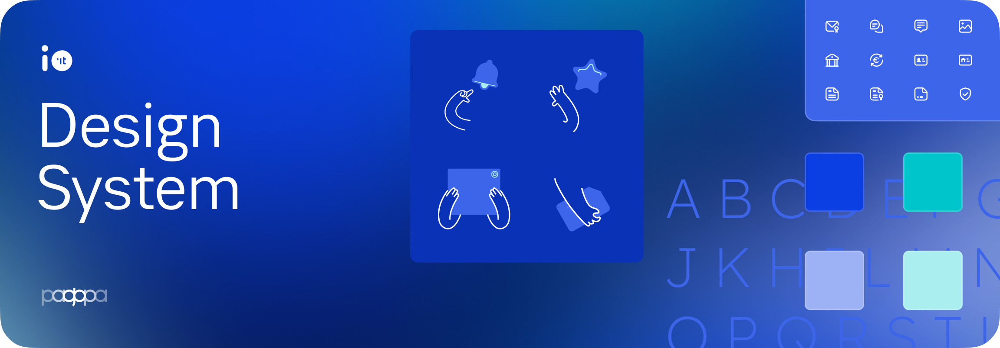

<div align="center">

<br />

<h3 align="center">A comprehensive component library for <a href="https://github.com/pagopa/io-app">IO App</a></h3>

<a href="https://www.npmjs.com/package/@pagopa/io-app-design-system">
  
</a>

</div>

---

# @pagopa/io-app-design-system

The IO App Design System library provides the complete set of design tokens, primitives, and UI components used by the [IO mobile app](../../apps/main-app/README.md). It lives inside the `pagopa/io-app` monorepo as the `libs/design-system` workspace package.

---

## Table of contents

- [Getting started](#getting-started)
- [Usage](#usage)
- [Architecture](#architecture)
- [Development workflow](#development-workflow)
- [Contributing](#contributing)
- [License](#license)

---

## Getting started

### Install (external consumers)

```bash
pnpm add @pagopa/io-app-design-system
```

Wrap the root of your app with `SafeAreaProvider` from [`react-native-safe-area-context`](https://github.com/th3rdwave/react-native-safe-area-context). Apply the same wrapper to root components of modals and routes when using [`react-native-screens`](https://github.com/software-mansion/react-native-screens):

```tsx
import { SafeAreaProvider } from 'react-native-safe-area-context';

function App() {
  return <SafeAreaProvider>...</SafeAreaProvider>;
}
```

### Peer dependencies

The library requires the following peer dependencies to be installed by the consuming app:

| Package | Notes |
|---------|-------|
| `react-native-reanimated` `>=4.0.0` | Animations |
| `react-native-svg` | Vector asset rendering |
| `react-native-pulsar` | Haptic feedback |
| `react-native-safe-area-context` | Safe area spacing |
| `react-native-linear-gradient` | Gradient components |
| `react-native-easing-gradient` | Easing gradient utilities |
| `react-native-gesture-handler` | Gesture handling |
| `react-native-worklets` | Reanimated worklets |

---

## Usage

Import any exported component directly:

```tsx
import { IOButton } from '@pagopa/io-app-design-system';

const MyScreen = () => (
  <IOButton
    variant="solid"
    accessibilityLabel="Confirm payment"
    label="Confirm"
    onPress={() => handleConfirm()}
  />
);
```

---

## Architecture

### Core

Essential design-language primitives shared across all components:

| Export | Description |
|--------|-------------|
| `IOColors` | Full colour palette, light/dark themes, colour utilities |
| `IOSpacing` | Spacing scale and component-level spacing values |
| `IOStyles` | Common reusable StyleSheet fragments |
| `IOShapes` | Shape attributes (border radii) |
| `IOAnimations` | Animation constants for interactive elements |
| `IOTransitions` | Reusable enter/exit transitions for Reanimated |

→ [Explore `src/core`](./src/core)

### Foundation

Atomic building blocks:

- [**Typography**](./src/components/typography/README.md) — all text variants
- [**Layout**](./src/components/layout/README.md) — `ContentWrapper`, `VStack`, `HStack`, `VSpacer`, `HSpacing`, `Divider`
- [**Icons**](./src/components/icons/README.md) — vector icons sized 12–56 px
- [**Pictograms**](./src/components/pictograms/README.md) — large vector illustrations (> 56 px)
- [**Logos**](./src/components/logos/README.md) — payment network logos, `Avatar`
- **Loaders** — `LoadingSpinner`

### Components

Higher-level interactive and informational components:

- **Buttons** — `IOButton`, `IconButton`, `IconButtonSolid`
- **TextInput**
- **List items** — `ListItemAction`, `ListItemAmount`, `ListItemHeader`, `ListItemInfo`, `ListItemInfoCopy`, `ListItemNav`, `ListItemNavAlert`, `ListItemTransaction`
- **Modules** — `ModuleAttachment`, `ModuleCheckout`, `ModuleCredential`, `ModuleIDP`, `ModuleNavigation`, `ModulePaymentNotice`, `ModuleSummary`
- **Badges & Tags** — `Badge`, `Tag`
- **Selection** — `CheckboxLabel`, `ListItemCheckbox`, `ListItemRadio`, `ListItemRadioWithAmount`, `RadioGroup`, `ListItemSwitch`, `NativeSwitch`
- **Accordion** — `AccordionItem`
- **Alert** — `Alert`, `AlertEdgeToEdge`
- **Advice & Banners** — `FeatureInfo`, `Banner`
- [**Headers**](./src/components/headers/README.md) — `HeaderFirstLevel`, `HeaderSecondLevel`, `ModalBSHeader`
- [**Templates**](./src/components/templates/README.md) — `Dismissable`, `ForceScrollDownView`

→ [Explore `src/components`](./src/components)

### Functions

Utility wrappers around external libraries.

→ [Explore `src/functions`](./src/functions)

### Contexts

React contexts exported by the library.

→ [Explore `src/context`](./src/context)

---

## Development workflow

The design system is developed and tested inside the IO main app, which acts as the playground environment. There is no standalone example app.

### Setup

```bash
# From the repository root
corepack enable
corepack prepare --activate
pnpm install

# Install iOS pods (macOS only)
pnpm nx run main-app:dev-pod-install
```

### Preview changes in the app

```bash
# iOS
pnpm nx run main-app:run-ios

# Android
pnpm nx run main-app:dev-run-android
```

Navigate to the **Design System** section inside the app (visible in developer mode) to inspect and test components in a real native environment.

> [!IMPORTANT]
> Always test new components in the actual native environment. Browser-based rendering introduces technical trade-offs that do not reflect real usage conditions.

### Build the library

The library is built automatically as part of `pnpm install` via the `postinstall` hook (`nx prepack io-app-design-system`). To trigger a manual build:

```bash
pnpm nx run io-app-design-system:prepack
```

### Add a new icon

See [src/components/icons/README.md](./src/components/icons/README.md#add-a-new-icon).

### Add a new pictogram

See [src/components/pictograms/README.md](./src/components/pictograms/README.md#add-a-new-pictogram).

### Quality checks

```bash
# Type-check
pnpm nx tsc-noemit io-app-design-system

# Lint
pnpm nx lint io-app-design-system

# Tests
pnpm nx test io-app-design-system

# Format
pnpm prettify
```

---

## Contributing

See [`CONTRIBUTING.md`](../../CONTRIBUTING.md) for the full workflow.

If you want to suggest new components or improvements, open an issue first to align with the design team before investing in implementation.

---

## License

[MIT](../../LICENSE)
