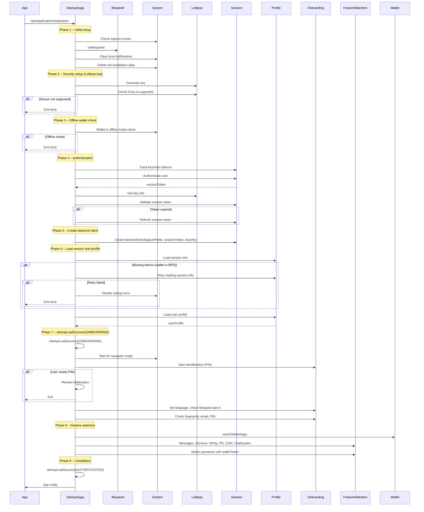

```mermaid
sequenceDiagram
  participant App
  participant StartupSaga
  participant Mixpanel
  participant System
  participant Lollipop
  participant Session
  participant Profile
  participant Onboarding
  participant FeatureWatchers
  participant Wallet

  App->>StartupSaga: startApplicationInitialization

  %% --- Phase 1: Initial setup ---
  note over StartupSaga: Phase 1 – Initial setup
  StartupSaga->>System: Check ingress screen
  StartupSaga->>Mixpanel: initMixpanel
  StartupSaga->>System: Clear local notifications
  StartupSaga->>System: Delete old installation data

  %% --- Phase 2: Security setup (Lollipop key) ---
  note over StartupSaga: Phase 2 – Security setup (Lollipop key)
  StartupSaga->>Lollipop: Generate key
  StartupSaga->>Lollipop: Check if key is supported
  alt Device not supported
    StartupSaga-->>App: Exit early
  end

  %% --- Phase 3: Offline mode check ---
  note over StartupSaga: Phase 3 – Offline wallet check
  StartupSaga->>System: Wallet in offline mode check
  alt Offline mode
    StartupSaga-->>App: Exit early
  end

  %% --- Phase 4: Authentication ---
  note over StartupSaga: Phase 4 – Authentication
  StartupSaga->>Session: Track keychain failures
  StartupSaga->>Session: Authenticate user
  Session-->>StartupSaga: sessionToken
  StartupSaga->>Lollipop: Get key info
  StartupSaga->>Session: Validate session token
  alt Token expired
    StartupSaga->>Session: Refresh session token
  end

  %% --- Phase 5: Create backend client ---
  note over StartupSaga: Phase 5 – Create backend client
  StartupSaga->>Session: Create backendClient(apiUrlPrefix, sessionToken, keyInfo)

  %% --- Phase 6: Load session and profile ---
  note over StartupSaga: Phase 6 – Load session and profile
  StartupSaga->>Profile: Load session info
  alt Missing tokens (wallet or BPD)
    StartupSaga->>Profile: Retry loading session info
    alt Retry failed
      StartupSaga->>System: Handle startup error
      StartupSaga-->>App: Exit early
    end
  end

  StartupSaga->>Profile: Load user profile
  Profile-->>StartupSaga: userProfile

  %% --- Phase 7: Start onboarding ---
  note over StartupSaga: Phase 7 – startupLoadSuccess(ONBOARDING)
  StartupSaga->>StartupSaga: startupLoadSuccess(ONBOARDING)
  StartupSaga->>System: Wait for navigator ready
  StartupSaga->>Onboarding: Start identification (PIN)
  alt User resets PIN
    StartupSaga->>StartupSaga: Restart initialization
    StartupSaga-->>App: Exit
  end

  StartupSaga->>Onboarding: Set language, check Mixpanel opt-in
  StartupSaga->>Onboarding: Check fingerprint, email, PIN

  %% --- Phase 8: Feature watchers ---
  note over StartupSaga: Phase 8 – Feature watchers
  StartupSaga->>Wallet: watchWalletSaga
  StartupSaga->>FeatureWatchers: Messages, Services, IDPay, PN, CGN, TrialSystem
  StartupSaga->>FeatureWatchers: Watch payments with walletToken

  %% --- Phase 9: Completion ---
  note over StartupSaga: Phase 9 – Completion
  StartupSaga->>StartupSaga: startupLoadSuccess(AUTHENTICATED)
  StartupSaga->>App: App ready

```
